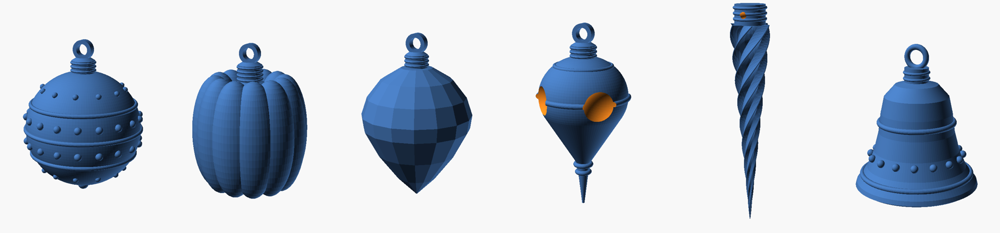
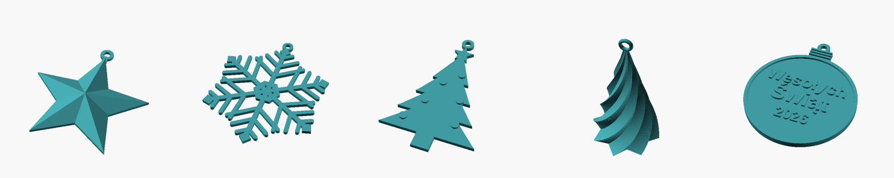

# Ozdoby choinkowe na drukarkę 3D

Dwie kolekcje:

- **[Kolekcja „szklana”](#kolekcja-szklana-do-malowania)** — bombki w stylu
  dawnych dmuchanych szklanych ozdób, zaprojektowane do malowania.
- **[Kolekcja płaska](#kolekcja-płaska)** — proste zawieszki drukowane w 30–45 min.

## Kolekcja „szklana” (do malowania)



Plik źródłowy: [`ozdoby_szklane.scad`](ozdoby_szklane.scad), gotowe STL:
[`stl/szklane/`](stl/szklane).

| Model | Wygląd | Wymiary ozdoby | Filament | Czas** |
|---|---|---|---|---|
| `kula_kropki` | kula Ø60 z wypukłymi pasami i perełkami | 60 × 92 mm | 26 g | 2 h 00 |
| `kula_karbowana` | vintage „dynia” z 12 żebrami | 58 × 89 mm | 27 g | 1 h 55 |
| `krysztal` | fasetowany jak szlifowane szkło | 56 × 88 mm | 21 g | 1 h 25 |
| `kropla_vintage` | kropla z wklęsłymi „reflektorami” i szpicem | 47 × 100 mm | 20 g | 1 h 30 |
| `sopel` | skręcony sopel | 20 × 104 mm | 7 g | 1 h 05 |
| `dzwonek` | dzwonek z perełkami i wywiniętym brzegiem | 52 × 61 mm | 19 g | 1 h 15 |

\** Wyliczone w PrusaSlicerze: PLA, warstwa 0,16 mm, umiarkowane prędkości.
Szybkie drukarki (Bambu Lab, Creality K1 itp.) zrobią to w ok. 50–60 % tego czasu.

### Jak to działa

- **Kule, kryształ i kropla** drukują się jako **dwie połówki** leżące
  przekrojem na stole. Dzięki temu nie ma podpór, a cała zaokrąglona
  powierzchnia wychodzi gładka. W połówkach są po dwa otwory na **kołki
  z filamentu 1,75 mm**: utnij 2 kawałki po ~11 mm, włóż, posmaruj
  przekrój klejem cyjanoakrylowym (super glue) i ściśnij.
- **Sopel** drukuje się szpicem do góry, a zawiesza przez poziomy otwór
  w kapturku (nitka albo haczyk z drutu).
- **Dzwonek** drukuje się w całości, otworem do stołu.
- `podglad = true` w Customizerze pokazuje złożoną ozdobę;
  `skala` (np. 0.8 albo 1.2) zmienia rozmiar całości.

### Ustawienia druku (kolekcja szklana)

- PLA, warstwa **0,16 mm** (mniej szlifowania przed malowaniem; 0,12 mm jeszcze lepiej).
- **2 obrysy, 5 % wypełnienia gyroid**: ozdoby są lżejsze (kula ~26 g zamiast ~39 g)
  i nie uginają gałązek.
- Podpory: wyłączone. Brim 5 mm tylko dla sopla.
- Dwie połówki jednej ozdoby mieszczą się na stole obok siebie, a na stole
  22 × 22 cm zmieścisz 2–3 komplety naraz.

### Efekt szkła: malowanie krok po kroku

Prawdziwe bombki to srebrzone szkło pokryte przezroczystym kolorowym lakierem.
Ten sam układ warstw daje na plastiku najbardziej „szklany” efekt.

1. **Sklej połówki.** Szczelinę na łączeniu wypełnij szpachlówką modelarską.
2. **Szlifuj:** papier 240 → 400 (na mokro). Wystarczy zgładzić linie warstw.
3. **Podkład wypełniający** w sprayu (filler primer), 2–3 cienkie warstwy,
   potem szlif 600–800 na mokro. Im gładszy podkład, tym bardziej lustrzany efekt.
4. **Baza lustrzana:** spray „chrome / efekt lustra” (albo srebrny metalik).
5. **Kolor szkła:** transparentny lakier „candy” (czerwony, zielony, niebieski,
   złoty), kilka cienkich warstw. Srebro prześwituje i świeci jak szkło.
6. **Detale:** perełki, pasy, żebra i reflektory pomaluj złotym lub białym
   markerem akrylowym, albo posyp brokatem na klej.
7. **Lakier bezbarwny na wysoki połysk** (najlepiej 2K, jest najtwardszy i
   najbardziej szklisty). Alternatywa: cienka warstwa żywicy epoksydowej
   do powlekania wydruków, która zakrywa resztki linii warstw.

Do malowania zawieś ozdobę za oczko na drucie, na przykład na wieszaku.

Sopel i dzwonek dobrze wyglądają bez malowania, wydrukowane z
**przezroczystego PETG** (temperatura 240–250 °C, wolno, 100 % wypełnienia):
wychodzą matowe, jak oszroniony lód. Prawdziwej przejrzystości szkła z
drukarki FDM nie da się uzyskać.

---

## Kolekcja płaska



Pięć ozdób w jednym parametrycznym pliku [`ozdoby.scad`](ozdoby.scad)
oraz gotowe pliki STL w katalogu [`stl/`](stl). Wszystkie modele leżą
płasko na stole, mają oczko do zawieszenia i **drukują się bez podpór**.

| Model | Plik STL | Rozmiar (ok.) | Czas druku (orient.)* |
|---|---|---|---|
| Gwiazda fasetowana | `stl/gwiazda.stl` | 67 × 70 × 9 mm | ~35 min |
| Płatek śniegu | `stl/platek.stl` | 76 × 94 × 2,4 mm | ~30 min |
| Choinka z bombkami | `stl/choinka.stl` | 57 × 89 × 3,6 mm | ~40 min |
| Choinka spiralna 3D | `stl/choinka_spiralna.stl` | 44 × 44 × 77 mm | ~1 h |
| Bombka z napisem | `stl/bombka_napis.stl` | 64 × 77 × 3,6 mm | ~45 min |

\* PLA, dysza 0,4 mm, warstwa 0,2 mm, typowa prędkość — zależy od drukarki.

### Ustawienia druku

- **Materiał:** PLA (najprościej) lub PETG (odporniejszy na ciepło lampek).
  Świetnie wyglądają filamenty „silk” złote/srebrne, brokatowe i
  świecące w ciemności.
- **Warstwa:** 0,2 mm (gwiazda i choinka spiralna ładniej przy 0,12–0,16 mm).
- **Ściany:** 3 obrysy — płaskie ozdoby wyjdą wtedy praktycznie pełne i mocne.
- **Wypełnienie:** 15–20 % (dla płaskich i tak prawie nieistotne).
- **Podpory:** wyłączone. **Brim:** przyda się przy choince spiralnej i gwieździe —
  ostre końce ramion przy stole lubią się odklejać.
- **Prasowanie (ironing)** górnej powierzchni płatka i bombki daje gładki,
  błyszczący wierzch.

### Dwa kolory bez drukarki wielokolorowej

Choinka i bombka mają wypukłe detale (bombki na choince, napis i obwódka
na bombce) o wysokości 1,2 mm nad korpusem 2,4 mm. Wstaw w slicerze
**zmianę filamentu (M600 / „Color change”) na wysokości 2,6 mm** —
korpus wydrukuje się np. na zielono/czerwono, a detale na złoto/biało.

## Własne wersje (OpenSCAD)

1. Zainstaluj [OpenSCAD](https://openscad.org) i otwórz `ozdoby.scad`.
2. Włącz *Window → Customizer* — po prawej pojawią się suwaki i pola.
3. Wybierz `model`, zmień wymiary albo **napis na bombce** (np. imię
   i rok — świetne jako prezent albo zawieszka na prezent).
4. `F6` (Render), potem `F7` (Export STL).

Z linii poleceń:

```bash
openscad -D 'model="bombka_napis"' -D 'napis_1="Dla"' -D 'napis_2="Zosi"' \
         -o bombka_zosia.stl ozdoby.scad
```

Przydatne parametry:

| Parametr | Co robi |
|---|---|
| `gwiazda_ramiona` | liczba ramion gwiazdy (5, 6, 8…) |
| `gwiazda_szczyt` | jak bardzo wypukła jest gwiazda |
| `platek_promien`, `platek_ramie` | wielkość płatka i grubość ramion |
| `spirala_skret` | skręt choinki spiralnej; powyżej ~200° nawisy robią się zbyt strome |
| `spirala_ramiona` | liczba żeber choinki spiralnej |
| `napis_1/2/3`, `czcionka` | tekst na bombce (krótkie słowa — do ~9 liter w linii) |
| `uszko_srednica` | średnica oczka na wstążkę/nitkę |

### Pomysły na wykończenie

- Przewlecz cienką czerwoną wstążkę, sznurek jutowy albo złotą nitkę.
- Płatek wydrukowany z białego PETG lub przezroczystego filamentu
  pięknie łapie światło lampek.
- Gwiazdę ze złotego „silk” PLA można dać na czubek małej choinki —
  wystarczy przykleić od spodu stożek ze zwiniętego kartonu.
- Pomaluj wypukły napis złotym markerem akrylowym, jeśli drukujesz
  w jednym kolorze.
