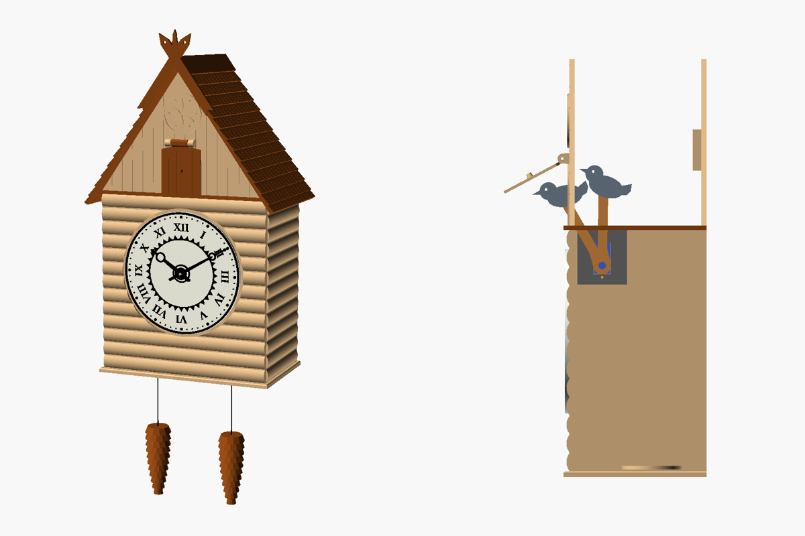

# Zegar z kukułką w stylu zakopiańskim



Góralska chatka z bali, ze stromym dachem krytym gontem, śparogami i pazdurem na szczycie
oraz słoneczkiem (rozetą) nad drzwiczkami. Tarcza ma cyfry rzymskie i wzór „wilcze zęby”.

- **Godzinę** pokazuje zwykły mechanizm kwarcowy na baterię AA.
- **Kukułka** naprawdę wyskakuje. Co pełną godzinę serwo wysuwa ptaka, ptak wypycha
  drzwiczki i kuka tyle razy, która jest godzina. O wpół do kuka raz. Nocą milczy.
  Steruje tym ESP32, który bierze dokładny czas z internetu.

Wymiary: szerokość z dachem około 190 mm, głębokość 130 mm, wysokość około 340 mm (bez szyszek).

## Co jest w folderze

| Ścieżka | Zawartość |
|---|---|
| `kukulka.scad` | model źródłowy (OpenSCAD), wszystkie wymiary są parametrami |
| `stl/` | 19 części gotowych do druku |
| `kukulka_esp32/` | program na ESP32 (`kukulka_esp32.ino`) i ustawienia (`ustawienia.h`) |
| `dzwiek/mp3/0001.mp3` | dźwięk „ku-ku” na kartę microSD |
| `dzwiek/generuj_kuku.py` | skrypt, który ten dźwięk wygenerował (możesz zmienić tony) |

## Lista zakupów

| Element | Uwagi |
|---|---|
| Mechanizm kwarcowy z tuleją M8 | korpus ok. 56×56 mm, **gwint min. 5 mm**, najlepiej cichy („sweep”) |
| ESP32 DevKit (30 pin) | np. ESP32-WROOM-32 DevKit V1 |
| Serwo SG90 | z kompletem orczyków i wkręcików |
| DFPlayer Mini | odtwarzacz MP3 |
| Karta microSD | dowolna mała (do 32 GB), sformatowana w FAT32 |
| Głośnik Ø40 mm, 3 W, 4–8 Ω | |
| Rezystor 1 kΩ | w linię TX → RX odtwarzacza (eliminuje szum) |
| Kondensator 470 µF / 10 V | na zasilaniu 5 V przy serwie |
| Zasilacz USB 5 V / 2 A + kabel micro-USB | kabel wychodzi przez wycięcie w tylnej ścianie |
| 4 wkręty M3×10 (albo 2,9×10 do plastiku) | do zdejmowanej tylnej ściany |
| Kawałek filamentu 1,75 mm | oś zawiasu drzwiczek |
| Przewody, taśma dwustronna, klej (cyjanoakryl albo do PLA) | |
| Sznurek lub łańcuszek, 2× ok. 60 cm | na szyszki (ozdoba) |
| Bateria AA, wkręt do ściany z łbem Ø6–9 mm | |

## Drukowanie

Wszystkie części leżą w plikach tak, jak trzeba je położyć na stole. Ozdobna strona
jest u góry i żadna część nie potrzebuje podpór. Największe są podłoga (178 × 104 mm)
i ściany (170 × 176 mm), więc wystarczy stół 180 × 180 mm.

| Plik | Szt. | Kolor (propozycja) | Uwagi |
|---|---|---|---|
| `test_otworow` | 1 | dowolny | **najpierw**: sprawdź pasowanie wskazówek, tarczy i osi zawiasu |
| `sciana_przednia` | 1 | jasne drewno | bale u góry |
| `sciana_boczna` | **2** | jasne drewno | |
| `sciana_tylna` | 1 | jasne drewno | |
| `podloga` | 1 | jasne drewno | z gniazdem głośnika i kostkami pod wkręty |
| `strop` | 1 | ciemny brąz | |
| `szczyt_przedni` | 1 | jasne drewno | z rozetą i uszami zawiasu |
| `szczyt_tylny` | 1 | jasne drewno | z wieszakiem |
| `dach` | **2** | ciemny brąz | gont u góry |
| `kalenica` | 1 | ciemny brąz | stoi na nóżkach |
| `sparogi` | 1 | ciemny brąz | |
| `drzwiczki` | 1 | ciemny brąz | |
| `tarcza` | 1 | kremowy → czarny | **zmiana filamentu na wysokości 2,5 mm** (cyfry wychodzą czarne) |
| `wskazowki` | 1 | czarny | najlepiej warstwa 0,12–0,16 mm, 100% wypełnienia |
| `kukulka` | 1 | szary/brązowy | drukowana na boku |
| `ramie` | 1 | dowolny | 100% wypełnienia |
| `uchwyt_serwa` | 1 | dowolny | |
| `kostka` | **2** | dowolny | |
| `szyszka` | **2** | ciemny brąz | drukowana szerokim końcem do stołu |

Ustawienia dla PLA: warstwa 0,2 mm, 3 obwody, wypełnienie 15%. Wszystkie części razem
zużyją około 0,5–0,6 kg filamentu. Ładnie wygląda filament „wood” (PLA z drewnem)
na ściany i szczyty.

## Połączenia elektroniki

```
ESP32 VIN (5 V) ──┬── DFPlayer VCC
                  ├── Serwo czerwony (+)
                  └── (+) kondensator 470 µF
ESP32 GND ────────┬── DFPlayer GND
                  ├── Serwo brązowy (−)
                  └── (−) kondensator 470 µF
ESP32 GPIO18 ──────── Serwo pomarańczowy (sygnał)
ESP32 GPIO17 (TX2) ── rezystor 1 kΩ ── DFPlayer RX
ESP32 GPIO16 (RX2) ── DFPlayer TX
DFPlayer SPK1, SPK2 ─ głośnik
```

Całość zasila jeden zasilacz USB podłączony do ESP32. Mechanizm kwarcowy ma własną baterię.

## Program

1. W Arduino IDE dodaj pakiet płytek **esp32** od Espressif Systems
   (*Narzędzia → Płytka → Menedżer płytek*). Wybierz płytkę **ESP32 Dev Module**.
2. W *Menedżerze bibliotek* zainstaluj **ESP32Servo** i **DFRobotDFPlayerMini**.
3. Otwórz `kukulka_esp32/kukulka_esp32.ino`. W zakładce `ustawienia.h` wpisz nazwę
   i hasło swojej sieci Wi-Fi. Możesz też zmienić godziny ciszy nocnej, głośność
   i kukanie o wpół do.
4. Wgraj program.
5. Na kartę microSD skopiuj folder `dzwiek/mp3` tak, żeby na karcie był plik
   `/mp3/0001.mp3`. Włóż kartę do DFPlayera.

Program kompiluje się bez ostrzeżeń dla ESP32 (pakiet esp32 3.0.7). Nie był jeszcze
uruchamiany na prawdziwym sprzęcie.

## Składanie

Do klejenia nadaje się cyjanoakryl albo klej do PLA. Na zdjęciu podglądu widać,
gdzie co jest.

1. **Test.** Wydrukuj `test_otworow` i sprawdź, czy wskazówki wchodzą ciasno na
   wałki mechanizmu, a tarcza swobodnie na tuleję. Jeśli nie, zmień parametry
   otworów w `kukulka.scad` (co 0,1 mm).
2. **Korpus.** Przyklej do podłogi ścianę przednią i obie boczne. Listwa na podłodze
   pokazuje, gdzie stoją. Ścianę tylną tylko przykręć dwoma dolnymi wkrętami, bez kleju.
3. **Strop.** Przyklej strop na górnych krawędziach ścian, równo z tyłem.
   Przykręć obie `kostki` do górnych otworów ściany tylnej i dopiero wtedy przyklej
   je do stropu i ścian bocznych. Dzięki temu otwory się zgodzą. Potem odkręć ścianę.
4. **Uchwyt serwa.** Włóż serwo w wycięcie uchwytu wałkiem w dół i przykręć je za
   uszy. Wałek ma wystawać w stronę środka domku, a półka uchwytu ma być skierowana
   w lewo (patrząc od frontu). Przyklej półkę pod stropem. Płaszczyzna, o którą opierają
   się uszy serwa, ma być 13 mm w lewo od środka. Przednia krawędź uchwytu ma być
   2 mm za ścianą przednią. Ramię z ptakiem przechodzi wtedy przez szczelinę w stropie.
5. **Szczyty.** Przyklej oba szczyty na stropie, równo z przodem i tyłem.
   Zawieś drzwiczki: przełóż kawałek filamentu 1,75 mm przez ucha i tuleję drzwiczek,
   a końce lekko roztop albo zaklej. Drzwiczki muszą opadać same.
6. **Kukułka (przed zamknięciem dachu).** Przyklej orczyk SG90 w wycięcie `ramienia`.
   Otwór w ramieniu daje dostęp do wkręta orczyka. Podłącz elektronikę i skalibruj
   ruch (opis niżej). Na koniec przez drzwiczki wciśnij ptaka na końcówkę ramienia.
7. **Dach.** Przyklej obie połacie na skośnych krawędziach szczytów, potem kalenicę
   i śparogi na przednich krawędziach połaci.
8. **Tarcza.** Przyklej tarczę na gładkim polu ściany przedniej. Od środka włóż
   mechanizm, od frontu załóż podkładkę i nakrętkę. Wciśnij wskazówki: godzinową
   i minutową ustaw razem na 12.
9. **Elektronika.** Głośnik włóż w gniazdo w podłodze, a ESP32 i DFPlayer przyklej
   taśmą. Kabel USB wyprowadź przez wycięcie w ścianie tylnej. Przykręć ścianę tylną
   czterema wkrętami.
10. **Szyszki.** Przewlecz sznurki przez otwory w podłodze i zawiąż węzły od środka.
    Na dole przewlecz sznurek przez szyszkę i zawiąż węzeł pod czubkiem.
11. **Zawieszenie.** Wkręć wkręt w ścianę, zostawiając ok. 3 mm. Nasuń zegar dużym
    otworem w szczycie tylnym i opuść go, żeby wkręt wszedł w szczelinę.

## Kalibracja kukułki

Kierunek obrotu i ustawienie orczyka różnią się między egzemplarzami serw, dlatego
kąty ustawia się raz, przed przyklejeniem dachu.

1. Podłącz ESP32 do komputera i otwórz *Monitor portu szeregowego* (115200,
   „Nowa linia”).
2. Wpisz `k 90`. Serwo stanie w środku zakresu. Załóż ramię z orczykiem tak, żeby
   stało prawie pionowo: około 1° do tyłu to pozycja schowana.
3. Wpisz `k 121`. Ptak powinien wyjść przez drzwiczki (ramię pochyla się do przodu
   o ok. 30°). Jeśli ramię pochyla się do tyłu, użyj `k 59`.
4. Znalezione kąty wpisz w `ustawienia.h` jako `KAT_SCHOWANA` i `KAT_WYSUNIETA`
   i wgraj program jeszcze raz.
5. `t 3` zakuka trzy razy. Przycisk **BOOT** na płytce kuka tyle razy, która jest
   godzina.

## Dostosowanie

Otwórz `kukulka.scad` w OpenSCAD (panel *Customizer*) albo podaj parametry w linii
poleceń:

```bash
openscad -D 'czesc="dach"' -D spad=50 -o dach.stl kukulka.scad
```

- `W`, `D`, `Hs`: szerokość, głębokość i wysokość ścian.
- `spad`: kąt dachu. Styl zakopiański ma 50–60°.
- `tarcza_d`, `tarcza_g`: średnica i grubość tarczy.
- `otwor_godz`, `otwor_min_d`, `otwor_min_plaska`, `otwor_walka`: dopasowanie
  do mechanizmu.
- `ramie_L`, `serwo_Y`, `serwo_pod_stropem`, `kat_ptaka`: geometria ruchu ptaka.
  Przy zmianie sprawdź widok `czesc="przekroj"`. OpenSCAD wypisuje w konsoli wymagany
  zakres ruchu serwa.
- `sg_*`: wymiary serwa SG90. Zmierz swoje suwmiarką, bo różnią się między producentami.

Złożenie podglądasz z `czesc="zlozenie"` (domyślnie), a ruch ptaka z `czesc="przekroj"`.
