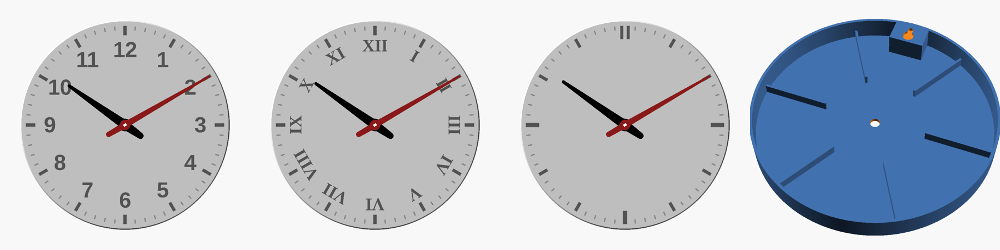

# Zegar ścienny do druku 3D



Parametryczny zegar ścienny o średnicy 200 mm (OpenSCAD). Pasuje do standardowego
mechanizmu kwarcowego. Tarcza drukuje się licem do stołu, więc front wychodzi gładki
i nie potrzeba podpór. Cyfry i kreski są wygrawerowane i można je wypełnić
wkładkami w kontrastowym kolorze.

## Pliki

| Plik | Co to jest |
|---|---|
| `zegar.scad` | model źródłowy, wszystkie wymiary są parametrami |
| `stl/tarcza.stl` | tarcza z obrzeżem, żebrami i wieszakiem (styl arabski, Ø200 mm) |
| `stl/wskazowki.stl` | wskazówka godzinowa i minutowa |
| `stl/wklady.stl` | wkładki cyfr i kresek godzinowych (z luzem 0,12 mm) |
| `stl/wklady_mmu.stl` | te same wkładki bez luzu, do drukarek wielokolorowych (AMS/MMU) |
| `stl/test_otworow.stl` | mały test pasowania otworów do mechanizmu, drukujesz go **najpierw** |

## Co kupić

- **Mechanizm kwarcowy** z gwintowaną tuleją M8, korpus około 56×56×16 mm, na baterię AA.
  Najlepiej cichy, bez tykania („sweep”, „płynący sekundnik”). Weź wersję z gwintem
  przynajmniej 5 mm, bo tarcza ma 3 mm grubości.
- Bateria AA.
- Wkręt do ściany z łbem o średnicy 6–9 mm (albo gwóźdź z łebkiem).
- Opcjonalnie klej (cyjanoakrylowy albo do PLA) do wkładek.

Mechanizm zwykle ma w komplecie metalowe wskazówki. Jeśli są dość długie, możesz ich
użyć zamiast drukowanych.

## Drukowanie

| Część | Ustawienie na stole | Wskazówki |
|---|---|---|
| `test_otworow` | płasko | 0,2 mm. Sprawdź, czy wskazówki wchodzą ciasno na wałki, a tarcza swobodnie na tuleję. |
| `tarcza` | jak w pliku, frontem w dół | warstwa 0,2 mm, 3 obwody, wypełnienie 15%, **bez podpór**. Na gładkiej lub teksturowanej płycie PEI front przejmie jej fakturę. |
| `wskazowki` | płasko | 0,2 mm (najlepiej 0,12–0,16), 100% wypełnienia. |
| `wklady` | płasko | 0,2 mm, kolor kontrastowy (np. tarcza biała, wkładki czarne). |

Tarcza ma Ø200 × 22 mm i mieści się na Ender 3, Prusa MK3/MK4, Bambu A1/P1/X1.
Na mniejszy stół (np. Bambu A1 mini) ustaw `srednica = 170`.

Szacunkowo zużyjesz około 110–130 g filamentu na tarczę i kilka gramów na resztę.
PLA albo PETG.

### Wariant wielokolorowy (AMS / MMU)

Zamiast wklejać wkładki, wczytaj w slicerze `tarcza.stl`, a następnie dodaj
`wklady_mmu.stl` **jako część tego samego obiektu** (Prusa/Orca: *Dodaj część*).
Pozycje się pokrywają, więc wystarczy przypisać wkładkom drugi filament.

## Składanie

1. Jeśli wkładki są drukowane osobno, odwróć każdą stroną od stołu do przodu i wciśnij
   w grawer, w razie potrzeby z kroplą kleju. Każda wkładka leży na wydruku w tym samym
   miejscu co jej wgłębienie, więc łatwo je dopasować.
2. Od tyłu włóż tuleję mechanizmu w otwór środkowy (dwunastka mechanizmu do góry,
   w stronę wieszaka). Od frontu nałóż podkładkę i dokręć nakrętkę.
3. Wciśnij wskazówkę godzinową na grubszą tuleję, ustawioną na pełną godzinę
   (np. na 12). Potem wciśnij minutową na 12 i ewentualnie dodaj sekundnik.
   Wskazówki nie mogą się o siebie ocierać.
4. Włóż baterię i ustaw godzinę pokrętłem z tyłu mechanizmu.
5. Wkręć wkręt w ścianę tak, żeby łeb odstawał około 3 mm. Nasuń zegar dużym
   otworem wieszaka na łeb i opuść go, żeby wkręt wszedł w szczelinę.

## Dostosowanie

Otwórz `zegar.scad` w OpenSCAD i zmieniaj wartości (panel *Customizer*) albo podaj je
w linii poleceń:

```bash
openscad -D 'czesc="tarcza"' -D 'styl="rzymskie"' -D srednica=180 -o tarcza.stl zegar.scad
```

Najważniejsze parametry:

- `styl`: `arabskie`, `rzymskie` albo `kreski`
- `srednica`: średnica zegara. Długości wskazówek i rozmiar cyfr skalują się same.
- `otwor_walka`, `otwor_godz`, `otwor_min_d`, `otwor_min_plaska`: dopasowanie do
  mechanizmu. Jeśli test pokaże luz albo zbyt duży wcisk, zmieniaj je co 0,1 mm.
- `grubosc_tarczy`: zwiększ tylko wtedy, gdy mechanizm ma dłuższy gwint.
- `glebokosc`: odstęp od ściany. Musi wynosić co najmniej grubość tarczy plus
  głębokość mechanizmu plus 2 mm.
- `minutnik`: włącza albo wyłącza 60 kresek minutowych.

Przy średnicy większej niż około 300 mm wskazówki robią się ciężkie. Wtedy użyj
mechanizmu o zwiększonym momencie („high torque”).
