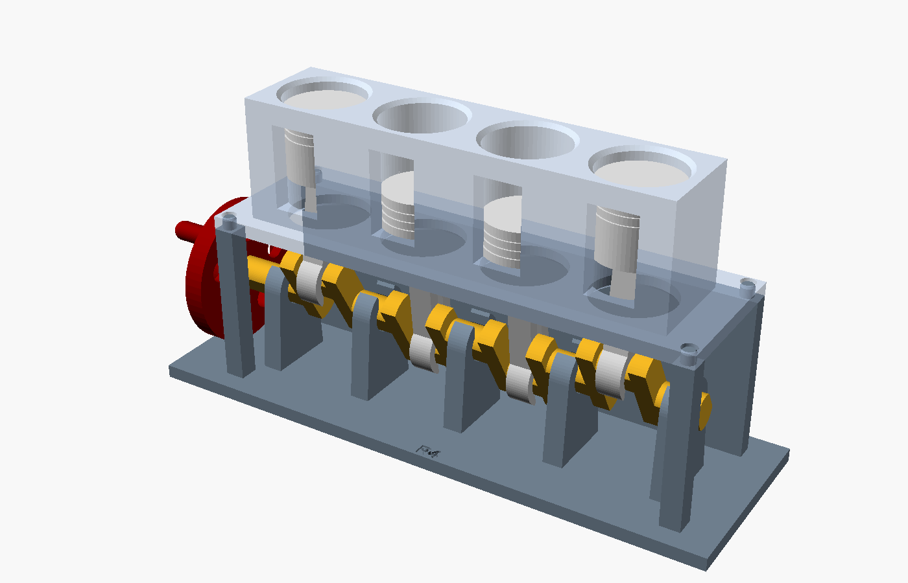

# Model silnika R4 do wydruku 3D

Ruchomy model czterocylindrowego silnika rzędowego z przekrojem. Kręcisz korbką
na kole zamachowym, a przez okienka w bloku widać, jak pracują tłoki
(układ wału płaski: tłoki 1 i 4 idą razem, 2 i 3 w przeciwfazie).



Animacja: [animacja.gif](animacja.gif)

## Części do wydruku (`stl/`)

| Plik | Ile sztuk | Uwagi |
|---|---|---|
| `podstawa.stl` | 1 | płyta, łożyska zatrzaskowe, tylna ściana i słupki; 176 × 57 × 55 mm |
| `blok.stl` | 1 | blok cylindrów z okienkami; drukuj płytą do stołu |
| `wal.stl` | 1 | wał korbowy leży płasko (czopy mają spłaszczenia); 158 mm długości |
| `korbowod.stl` | 4 | stopa korbowodu zatrzaskuje się na czopie |
| `tlok.stl` | 4 | drukuj denkiem do stołu |
| `sworzen.stl` | 4 | sworzeń tłokowy |
| `kolo.stl` | 1 | koło zamachowe z korbką |
| `male_czesci.stl` | — | 4 korbowody + 4 tłoki + 4 sworznie na jednym stole (zamiast trzech plików powyżej) |

Wszystkie pliki są już ułożone do druku i **nie potrzebują podpór**.
Model mieści się na stole 180 × 180 mm.

Zalecane ustawienia: PLA lub PETG, warstwa 0,2 mm, 3 obrysy, wypełnienie 20%.
Wał korbowy i korbowody najlepiej drukować z wypełnieniem 40% lub większym.

## Składanie (bez kleju)

1. Ustaw wał tak, by wykorbienia były skierowane pionowo (góra/dół), i wciśnij go
   od góry we wszystkie 5 łożysk – czopy wskoczą z kliknięciem.
2. Włóż korbowód między piasty tłoka i przełóż sworzeń. Powtórz dla 4 tłoków.
3. Ustaw wykorbienie w górnym lub dolnym położeniu i wciśnij stopę korbowodu
   na czop korbowy (otwór stopy skierowany w dół, w stronę wału).
4. Nasuń blok cylindrów od góry, prowadząc tłoki do otworów (wejścia mają fazki),
   i osadź go na kołkach ustalających podstawy.
5. Nasuń koło zamachowe na przedni koniec wału (otwór ma kształt „D”, więc
   samo się ustawi) – korbką na zewnątrz.

## Dopasowanie do drukarki

Model jest parametryczny – otwórz `silnik_r4.scad` w [OpenSCAD](https://openscad.org)
i zmień wartości na górze pliku:

- `zatrzask` (domyślnie 7,6 mm) – za ciasno wciska się wał lub korbowód? zwiększ do 7,8;
  za luźno trzyma? zmniejsz do 7,4,
- `luz`, `luz_tloka`, `luz_kolka` – luzy łożysk, tłoka w cylindrze i koła na wałku,
- `srednica`, `skok`, `dl_korb`, `podzialka`, `n_cyl` – wymiary silnika
  (przy dużych zmianach sprawdź podgląd złożenia, czy nic nie koliduje).

Po zmianach wygeneruj pliki STL poleceniem:

```bash
./eksport.sh
```

W OpenSCAD ustawienie `czesc = "zlozenie"` i włączenie **View → Animate**
(FPS 20, Steps 72) pokazuje pracujący silnik.
