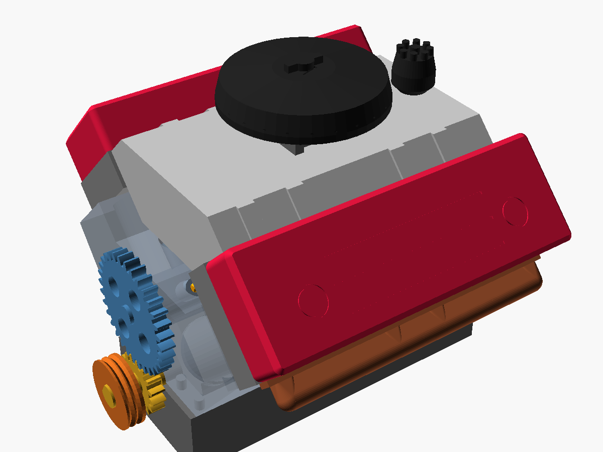
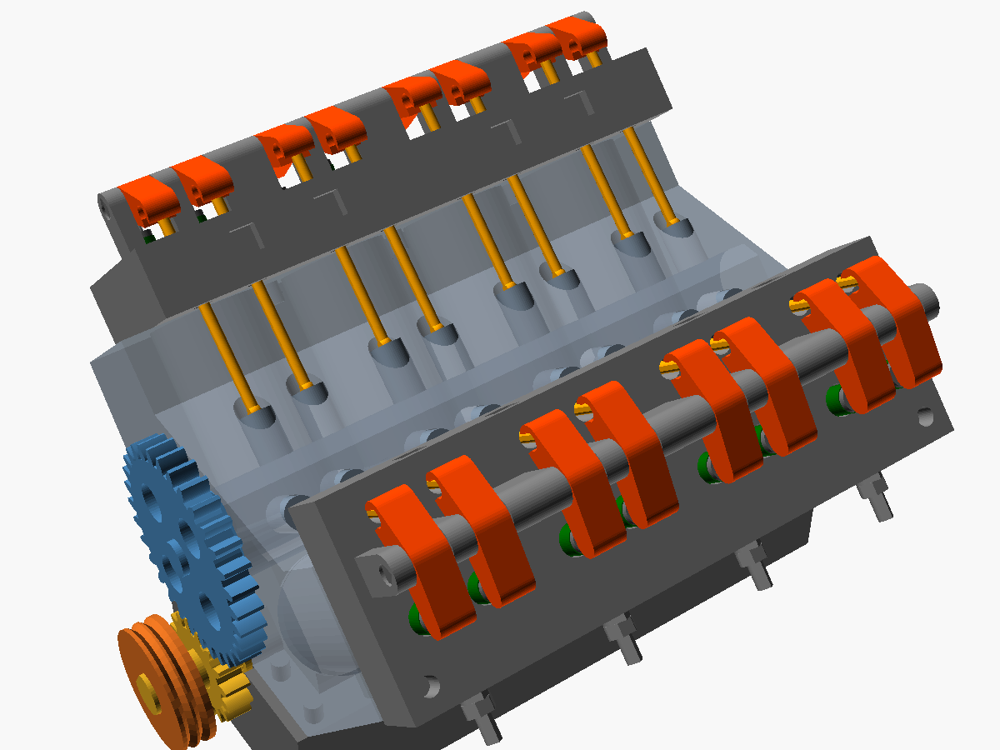
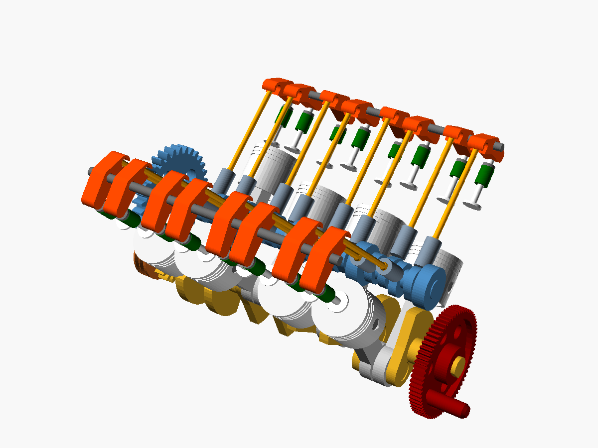

# Silnik V8 – działający model do wydruku 3D

Ruchomy model silnika V8 OHV (w stylu Chevroleta small-block) w skali ok. 1:4.
Kręcisz korbką na kole zamachowym, a wszystko porusza się jak w prawdziwym silniku:

- **8 tłoków** w dwóch rzędach ustawionych pod kątem 90°, po dwa korbowody na każdym czopie,
- **wał korbowy krzyżowy** (cross-plane, wykorbienia 0°-90°-270°-180°),
- **wałek rozrządu** w „V” bloku, napędzany kołami zębatymi **1:2** (ze znacznikami ustawienia rozrządu),
- **16 zaworów** otwieranych przez popychacze, drążki i dźwigienki (przełożenie 1,25), zamykanych sprężynami,
- **kolejność zapłonu 1-8-4-3-6-5-7-2**: co 90° obrotu wału kolejny cylinder jest w GMP sprężania,
- fazy rozrządu: zawór ssący najbardziej otwarty ok. 105° po GMP, wydechowy ok. 105° przed GMP,
  krótkie nakładanie się zaworów w GMP wydechu, jak w prawdziwym silniku.

| Całość | Rozrząd (bez osprzętu) | Sam mechanizm |
|---|---|---|
|  |  |  |

Animacja pełnego cyklu (720° wału = jeden obrót wałka rozrządu): [animacja_mechanizm.gif](animacja_mechanizm.gif)

Wymiary złożonego silnika: ok. 195 × 175 × 150 mm (dł. × szer. z kolektorami × wys.). Średnica cylindra 26 mm, skok 22 mm.
Numeracja cylindrów jak w GM: patrząc od tyłu (od koła zamachowego), lewy rząd to 1-3-5-7, prawy 2-4-6-8,
cylinder 1 jest z przodu po lewej. Wał obraca się zgodnie ze wskazówkami zegara, patrząc od przodu.

## Części do druku (`stl/`)

Każda część jest już ułożona do druku i **nie wymaga podpór**. Największe części (blok, miska, głowice)
mieszczą się na stole 180 × 180 mm.

| Plik | Szt. | Opis |
|---|---:|---|
| `blok.stl` | 1 | blok cylindrów z okienkami przekroju w lewym rzędzie |
| `pokrywa_lozyska.stl` | 5 | pokrywy łożysk głównych |
| `miska.stl` | 1 | miska olejowa, służy też jako podstawa; żebra podpierają pokrywy łożysk |
| `ramie_walu.stl` | 8 | ramiona wału z przeciwwagami |
| `czop_korbowy.stl` | 4 | czopy korbowe |
| `czop_glowny_1.stl` … `czop_glowny_5.stl` | po 1 | czopy główne (1 – przedni z nosem pod koła, 5 – tylny pod koło zamachowe) |
| `korbowod.stl` | 8 | korbowody |
| `pokrywa_korbowodu.stl` | 8 | pokrywy stóp korbowodów |
| `tlok.stl` | 8 | tłoki (drukowane denkiem do stołu) |
| `sworzen.stl` | 8 | sworznie tłokowe |
| `walek_rozrzadu_gora.stl`, `walek_rozrzadu_dol.stl` | po 1 | wałek rozrządu z 16 krzywkami, klejony z dwóch połówek |
| `kolo_rozrzadu_walu.stl` | 1 | koło zębate 16 z (na wale korbowym) |
| `kolo_rozrzadu_walka.stl` | 1 | koło zębate 32 z (na wałku rozrządu) |
| `popychacz.stl` | 16 | popychacze (szklankowe) |
| `drazek.stl` | 16 | drążki popychaczy |
| `dzwigienka.stl` | 16 | dźwigienki zaworów |
| `os_dzwigienek.stl` | 2 | osie dźwigienek |
| `zawor.stl` | 16 | zawory |
| `talerzyk.stl` | 16 | talerzyki sprężyn |
| `sprezyna_tpu.stl` | 16 | sprężyny zaworowe – **drukować z TPU** (albo użyć sprężynek z długopisów, patrz niżej) |
| `glowica.stl` | 2 | głowice (lewa i prawa są identyczne) |
| `pokrywa_zaworow.stl` | 2 | pokrywy zaworów (ładnie wyglądają z przezroczystego PETG) |
| `kolektor_wydechowy.stl` | 2 | kolektory wydechowe |
| `kolektor_ssacy.stl` | 1 | kolektor dolotowy |
| `gaznik.stl` | 1 | gaźnik czterogardzielowy |
| `filtr_powietrza.stl` | 1 | filtr powietrza |
| `aparat_zaplonowy.stl` | 1 | aparat zapłonowy |
| `kolo_zamachowe.stl` | 1 | koło zamachowe z wieńcem i korbką |
| `kolo_pasowe.stl` | 1 | koło pasowe wału |
| `kolek.stl` | 29 | kołki ustalające (głowice 6, pokrywy łożysk 10, miska 4, kolektory wydechowe 4, pokrywy zaworów 4, gaźnik–filtr 1) |

Razem 199 wydrukowanych części.

### Co trzeba mieć poza drukarką

- kawałek **filamentu 1,75 mm** – 22 odcinki po 7,5 mm (kołki pokryw korbowodów 16 szt. i połówek wałka 6 szt.),
- **klej cyjanoakrylowy** (super glue) – do wału korbowego, wałka rozrządu i talerzyków zaworów,
- 16 **sprężynek**: z TPU (plik `sprezyna_tpu.stl`) albo ze zwykłych długopisów
  (średnica zewnętrzna do 6,4 mm, wewnętrzna min. 3,2 mm, przycięte na ok. 10–11 mm),
- drobny papier ścierny.

Śruby nie są potrzebne.

### Ustawienia druku

- PLA lub PETG, warstwa 0,2 mm, 3 obrysy, wypełnienie 25–30%.
- Wał (ramiona, czopy), korbowody i koła zębate: wypełnienie min. 50%.
- Drobne części (zawory, drążki, popychacze, osie dźwigienek): warstwa 0,12 mm, najlepiej PETG
  (jest mniej kruchy). Drążki można zastąpić drutem stalowym Ø 2–2,5 mm z zaokrąglonymi końcami,
  długość 52 mm.
- Blok i głowice mają kilka krótkich mostów (np. sklepienie tunelu wałka rozrządu, gniazda zaworów) –
  drukują się bez podpór, wystarczy dobre chłodzenie.

### Czas i ilość filamentu

Wyliczone w PrusaSlicer 2.7 dla wszystkich 199 części (35 stołów, części powtarzalne drukowane
po kilka na stole) przy ustawieniach z punktu wyżej:

| Grupa | Klasyczna drukarka (Prusa MK3, Ender-3) | Szybka drukarka CoreXY (Bambu Lab, Prusa Core One) | Filament |
|---|---:|---:|---:|
| Blok | 21,2 h | 9,2 h | 245 g |
| Głowice z rozrządem (zawory, dźwigienki, drążki, popychacze) | 25,7 h | 9,8 h | 177 g |
| Układ korbowy (wał, korbowody, tłoki, pokrywy łożysk) | 16,1 h | 6,5 h | 139 g |
| Wałek i koła rozrządu | 4,6 h | 2,0 h | 38 g |
| Miska olejowa | 6,0 h | 2,1 h | 75 g |
| Osprzęt i pokrywy | 16,6 h | 6,5 h | 180 g |
| **Razem** | **ok. 90 h** | **ok. 36 h** | **ok. 855 g** |

Wystarcza jedna szpula 1 kg PLA (z zapasem na nieudane wydruki). Sprężyny z TPU to tylko ok. 4 g.

## Składanie

1. **Wał korbowy.** Złóż na sucho w kolejności: czop główny 1 → ramię → czop korbowy → ramię →
   czop główny 2 → … → czop główny 5. Końcówki czopów mają kształt „D”, więc każdy element pasuje
   tylko w jednym położeniu i wykorbienia same ustawią się pod kątami 0-90-270-180°. Połóż wał
   w gniazdach łożysk odwróconego bloku, sprawdź, czy się kręci, i dopiero wtedy sklej.
2. **Łożyska główne.** Blok do góry nogami, wał w gniazda, nałóż 5 pokryw łożysk na kołki ustalające.
3. **Tłoki i korbowody.** Włóż górną część korbowodu między piasty tłoka i wsuń sworzeń. Tłok
   z korbowodem wsuń od góry do cylindra, stopę korbowodu oprzyj na czopie (na każdym czopie: korbowód
   lewego rzędu z przodu, prawego z tyłu), od dołu załóż pokrywę i połącz ją dwoma kołkami
   z filamentu (kropla kleju tylko po stronie pokrywy).
4. **Miska olejowa** na 4 kołki ustalające i postaw silnik na misce.
5. **Wałek rozrządu.** Sklej obie połówki, wkładając w otwory 6 kołków z filamentu. Wsuń wałek od
   przodu w tunel nad wałem korbowym.
6. **Ustawienie rozrządu.** Nałóż małe koło na nos wału korbowego, a duże na wałek rozrządu, tak żeby
   **kropki-znaczniki** na obu kołach były naprzeciw siebie (kropka małego koła u góry, dużego na dole).
   To ustawienie odpowiada prawdziwemu „ustawianiu rozrządu na znaki”.
7. **Popychacze.** Wrzuć 16 popychaczy do otworów w dnie „V” i włóż w nie drążki.
8. **Zawory w głowicach.** Wsuń zawory od spodu, od góry nałóż sprężynkę i wciśnij talerzyk tak,
   żeby jego górna powierzchnia była **2,5 mm poniżej końca trzonka**. Talerzyk przyklej kroplą kleju.
9. **Głowice** na blok (po 3 kołki), drążki muszą przejść przez otwory w głowicy.
10. **Dźwigienki.** Przesuwaj oś przez kolejne słupki, nawlekając po drodze dźwigienki. Gniazda
    dźwigienek oprzyj na kulkach drążków, a noski na trzonkach zaworów.
11. Pokrywy zaworów, kolektory, gaźnik (filtr i gaźnik łączy kołek), aparat zapłonowy, koło pasowe
    i koło zamachowe.

Przed założeniem pokryw zaworów obróć powoli korbką: przy każdym obrocie wału co 90° otwierają się
kolejne zawory, a cały cykl (4 suwy wszystkich 8 cylindrów) trwa 2 obroty wału.

## Edycja modelu

Model jest parametryczny: `silnik_v8.scad` dla [OpenSCAD](https://openscad.org) 2021 lub nowszego.

- `czesc = "zlozenie"` i **View → Animate** (FPS 25, Steps 144) pokazuje pracujący silnik;
  `pokaz_pokrywy`, `pokaz_osprzet`, `przekroj` włączają i wyłączają elementy.
- Tolerancje: `luz` (łożyska, korbowody), średnica tłoka `d_tl`, otwory w poszczególnych częściach.
- `./eksport.sh` generuje wszystkie pliki STL od nowa.
- `./narzedzia/sprawdz_kolizje.sh` sprawdza, czy po zmianach żadne części nie wchodzą na siebie
  w pełnym cyklu 720° (co 5°). Wymaga `pip install trimesh manifold3d numpy`.

Model jest sprawdzony komputerowo, ale nie został jeszcze fizycznie wydrukowany i złożony.
Zależnie od drukarki niektóre pasowania (tłoki w cylindrach, dźwigienki między słupkami) mogą
wymagać przeszlifowania lub zmiany tolerancji.
